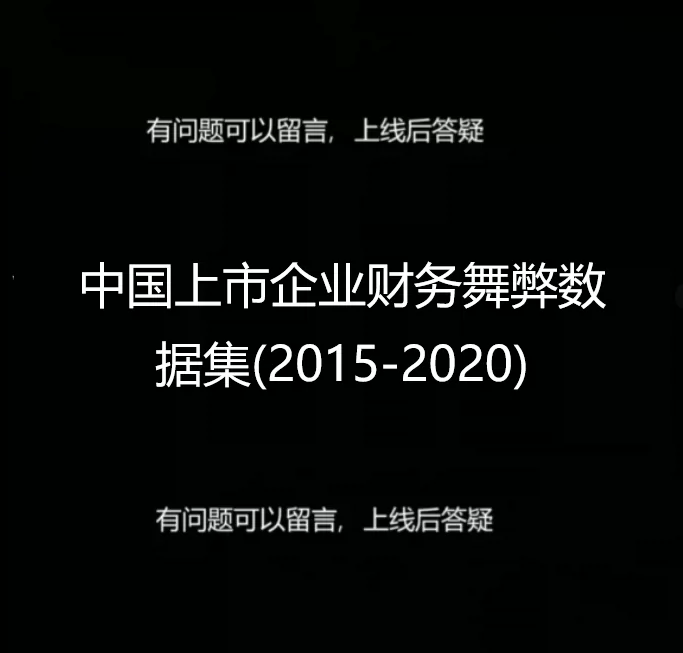
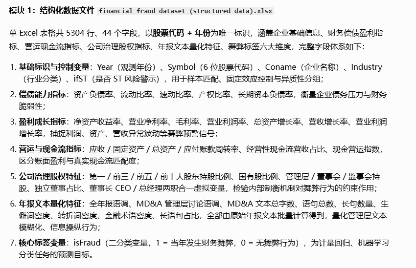
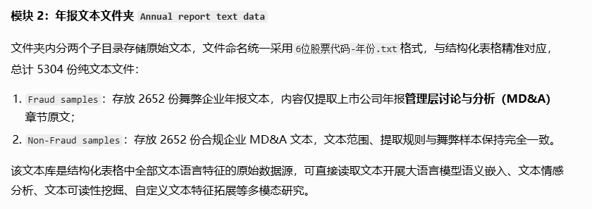
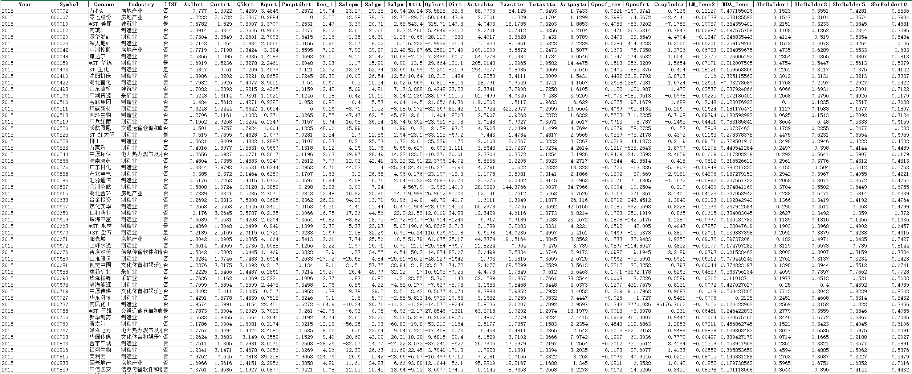

## Body

中国上市企业财务舞弊数据集(2015-2020)

该数据来自CSMAR数据库，涵盖2015-2020年沪深交易所上市企业的违规记录，聚焦虚构利润、虚列资产、虚假记载、重大遗漏和披露不实五类财务舞弊行为。剔除金融企业后，舞弊样本集包含1226家企业的2652条违规记录。同时，从CNRDS的ESG评级数据库中筛选出2652家未舞弊的优质企业，组成非舞弊样本集。数据集分为两部分：

1） 结构化数据：文件名为financial fraud dataset (structured data).xlsx，包含5304条记录，涵盖企业基本信息、财务指标、结构指标及年报文本的语言特征等43个字段，字段名见表1。

2） 年报文本数据：文件夹名为Annual report text data，包括2652份舞弊样本（文件名格式为Symbol-Year.txt）和2652份非舞弊样本（同格式）。文件内容为上市企业年报MD&A部分内容。

含作者文章

统计字段请看商品图片

## Images

item_1057904679726

Here is a pay link on Stripe ( https://buy.stripe.com/3cs8yP7sY87d0vu9AB ). Please contact me lonlonago@foxmail.com after funding $89, and I will send you a complete data files , thank you!

